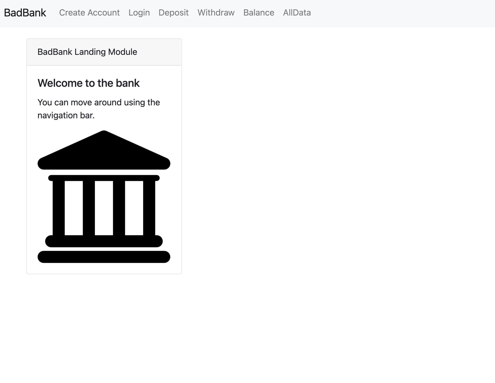

<h1 align="center">Welcome to bad-bank-mern 👋</h1>
  <a href="#" target="_blank">
    
  </a>
<p>
  
  <a href="#" target="_blank">
    
  </a>
  <a href="https://twitter.com/duffManCode" target="_blank">
    
  </a>
</p>

> Bad Bank three-tier application that uses React, Node.js/Express and MongoDB on a Docker container.

## Install

```sh
npm install
```

## Usage

```sh
docker run -p 27017:27017 -name badbank -d mongoDB
node index.js
```

## Run tests

```sh
npm run test
```

## Tech Used:

```sh
HTML
CSS
JavaScript
Bootstrap
Docker
Node.js
MongoDB
```

## Features

```sh
 Create Users
 Deposit funds
 Withdraw funds
 Check balance
 Review all data
```

## Upcoming Features

```sh
 Front-end Authentication
 Middleware Authentication
```

- Website: www.devduffy.com
- Twitter: [@duffManCode](https://twitter.com/duffManCode)
- Github: [@thewalkingduff](https://github.com/thewalkingduff)
- LinkedIn: [@devduffy](https://linkedin.com/in/devduffy)

## Show your support

Give a ⭐️ if this project helped you!

---

_This README was generated with ❤️ by [readme-md-generator](https://github.com/kefranabg/readme-md-generator)_
